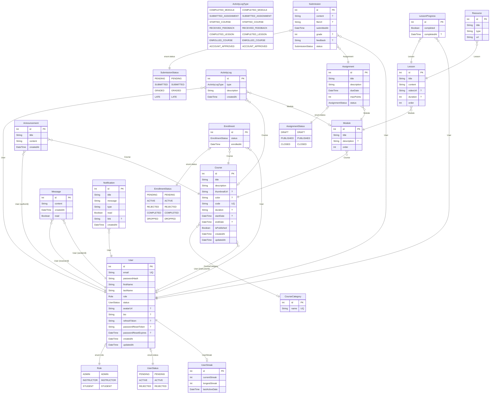

```mermaid
erDiagram

        ActivityLogType {
            COMPLETED_MODULE COMPLETED_MODULE
            SUBMITTED_ASSIGNMENT SUBMITTED_ASSIGNMENT
            STARTED_COURSE STARTED_COURSE
            RECEIVED_FEEDBACK RECEIVED_FEEDBACK
            COMPLETED_LESSON COMPLETED_LESSON
            ENROLLED_COURSE ENROLLED_COURSE
            ACCOUNT_APPROVED ACCOUNT_APPROVED
        }

        AssignmentStatus {
            DRAFT DRAFT
            PUBLISHED PUBLISHED
            CLOSED CLOSED
        }

        EnrollmentStatus {
            PENDING PENDING
            ACTIVE ACTIVE
            REJECTED REJECTED
            COMPLETED COMPLETED
            DROPPED DROPPED
        }

        Role {
            ADMIN ADMIN
            INSTRUCTOR INSTRUCTOR
            STUDENT STUDENT
        }

        UserStatus {
            PENDING PENDING
            ACTIVE ACTIVE
            REJECTED REJECTED
        }

        SubmissionStatus {
            PENDING PENDING
            SUBMITTED SUBMITTED
            GRADED GRADED
            LATE LATE
        }

  "ActivityLog" {
    Int id "PK"
    ActivityLogType type
    String description
    DateTime createdAt
  }

  "Announcement" {
    Int id "PK"
    String title
    String content
    DateTime createdAt
  }

  "Assignment" {
    Int id "PK"
    String title
    String description
    DateTime dueDate
    Int maxPoints
    AssignmentStatus status
  }

  "Course" {
    Int id "PK"
    String title
    String description
    String thumbnailUrl "?"
    String color "?"
    String code "UQ"
    String duration "?"
    DateTime startDate "?"
    DateTime endDate "?"
    Boolean isPublished
    DateTime createdAt
    DateTime updatedAt
  }

  "CourseCategory" {
    Int id "PK"
    String name "UQ"
  }

  "Enrollment" {
    Int id "PK"
    EnrollmentStatus status
    DateTime enrolledAt
  }

  "Lesson" {
    Int id "PK"
    String title
    String content
    String videoUrl "?"
    Int duration "?"
    Int order
  }

  "LessonProgress" {
    Int id "PK"
    Boolean completed
    DateTime completedAt "?"
  }

  "Message" {
    Int id "PK"
    String content
    DateTime createdAt
    Boolean read
  }

  "Notification" {
    Int id "PK"
    String title
    String message
    String type
    Boolean read
    String link "?"
    DateTime createdAt
  }

  "Module" {
    Int id "PK"
    String title
    String description "?"
    Int order
  }

  "Resource" {
    Int id "PK"
    String title
    String type
    String url
  }

  "Submission" {
    Int id "PK"
    String content "?"
    String fileUrl "?"
    DateTime submittedAt
    Int grade "?"
    String feedback "?"
    SubmissionStatus status
  }

  "User" {
    Int id "PK"
    String email "UQ"
    String passwordHash
    String firstName
    String lastName
    Role role
    UserStatus status
    String avatarUrl "?"
    String bio "?"
    String refreshToken "?"
    String passwordResetToken "?"
    DateTime passwordResetExpires "?"
    DateTime createdAt
    DateTime updatedAt
  }

  "UserStreak" {
    Int id "PK"
    Int currentStreak
    Int longestStreak
    DateTime lastActiveDate
  }

  "ActivityLog" }o--|| "User" : "User"
  "ActivityLog" }o--|o "Course" : "Course"
  "ActivityLog" }o--|o "Module" : "Module"
  "Announcement" }o--|| "User" : "User (authorId)"
  "Announcement" }o--|| "Course" : "Course"
  "Assignment" |o--|| "AssignmentStatus" : "enum:status"
  "Assignment" }o--|| "Module" : "Module"
  "Course" }o--|o "CourseCategory" : "CourseCategory"
  "Course" }o--|o "User" : "User (instructorId)"
  "Enrollment" |o--|| "EnrollmentStatus" : "enum:status"
  "Enrollment" }o--|| "Course" : "Course"
  "Enrollment" }o--|| "User" : "User"
  "Lesson" }o--|| "Module" : "Module"
  "LessonProgress" }o--|| "Lesson" : "Lesson"
  "LessonProgress" }o--|| "User" : "User"
  "Message" }o--|| "User" : "User (receiverId)"
  "Message" }o--|| "User" : "User (senderId)"
  "Notification" }o--|| "User" : "User"
  "Module" }o--|| "Course" : "Course"
  "Resource" }o--|| "Lesson" : "Lesson"
  "Submission" |o--|| "SubmissionStatus" : "enum:status"
  "Submission" }o--|| "Assignment" : "Assignment"
  "Submission" }o--|| "User" : "User"
  "User" |o--|| "Role" : "enum:role"
  "User" |o--|| "UserStatus" : "enum:status"
  "User" ||--|o "UserStreak" : "UserStreak"
```
