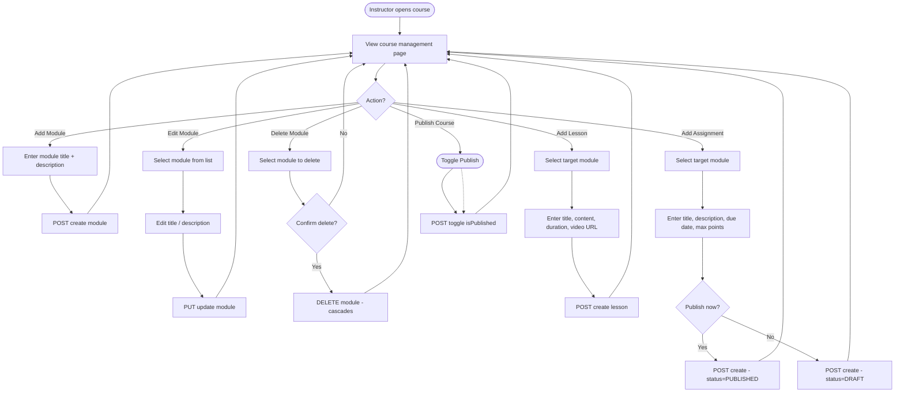

# Activity Diagrams — Lumify LMS

## 1. User Registration & Approval Workflow

```mermaid
flowchart TD
    Start([Start]) --> Register[User fills registration form]
    Register --> Validate{Fields valid?}
    Validate -->|No| ShowErrors[Show validation errors]
    ShowErrors --> Register
    Validate -->|Yes| DupCheck{Email already exists?}
    DupCheck -->|No| CreateUser[Create user with status=PENDING]
    DupCheck -->|PENDING account| RejectDup[Error: Already pending approval]
    DupCheck -->|ACTIVE account| RejectActive[Error: Account exists]
    DupCheck -->|REJECTED account| Reapply[Update existing record → PENDING]
    
    CreateUser --> PendingScreen[Show "Awaiting approval" screen]
    Reapply --> PendingScreen
    RejectDup --> Start
    RejectActive --> Start
    
    PendingScreen --> AdminReview[Admin views pending users list]
    AdminReview --> AdminDecision{Admin decision?}
    AdminDecision -->|Approve| SetActive[Update status to ACTIVE]
    AdminDecision -->|Reject| SetRejected[Update status to REJECTED]
    
    SetActive --> NotifyApproved[User can now login]
    SetRejected --> NotifyRejected[User notified of rejection]
    NotifyRejected --> CanReapply[User may re-apply]
    
    NotifyApproved --> Login([User logs in → Dashboard])
```

## 2. Course Content Management Workflow (Instructor)



## 3. Assignment Grading Workflow

```mermaid
flowchart TD
    Start([Assignment published]) --> StudentView[Student views assignment]
    StudentView --> HasSubmission{Already submitted?}
    
    HasSubmission -->|No| FillForm[Fill content + attach file]
    FillForm --> ValidateInput{Content or file provided?}
    ValidateInput -->|No| FillForm
    ValidateInput -->|Yes| ValidateFile{Has file attachment?}
    ValidateFile -->|Yes| CheckType{Valid type?}
    CheckType -->|No| RejectType[Error: File type not allowed]
    RejectType --> FillForm
    CheckType -->|Yes| CheckSize{Under 10MB?}
    CheckSize -->|No| RejectSize[Error: File too large]
    RejectSize --> FillForm
    CheckSize -->|Yes| SaveFile[Save file to /public/uploads/]
    ValidateFile -->|No| CreateSubmission
    SaveFile --> CreateSubmission[Upsert Submission - status=SUBMITTED]
    CreateSubmission --> SubmittedScreen[Show submission confirmation]
    
    HasSubmission -->|Yes, GRADED| ShowGrade[Show grade + feedback]
    ShowGrade --> NoResubmit[Resubmit disabled]
    
    HasSubmission -->|Yes, SUBMITTED| AwaitingGrade[Show "Awaiting grade"]
    
    SubmittedScreen --> InstructorQueue[Submission appears in instructor queue]
    
    InstructorQueue --> InstOpen[Instructor opens submission]
    InstOpen --> ReviewContent[Review content + download file]
    ReviewContent --> EnterGrade[Enter numeric grade + feedback]
    EnterGrade --> SaveGrade[POST grade submission]
    SaveGrade --> VerifyOwnership{Instructor owns course?}
    VerifyOwnership -->|Yes| UpdateSubmission[Update submission: grade, feedback, status=GRADED]
    VerifyOwnership -->|No| RejectGrade[403 Forbidden]
    UpdateSubmission --> CreateNotif[Create notification for student]
    CreateNotif --> GradeSaved[Grade saved]
    
    GradeSaved --> StudentNotified([Student receives notification])
    StudentNotified --> StudentView
```
