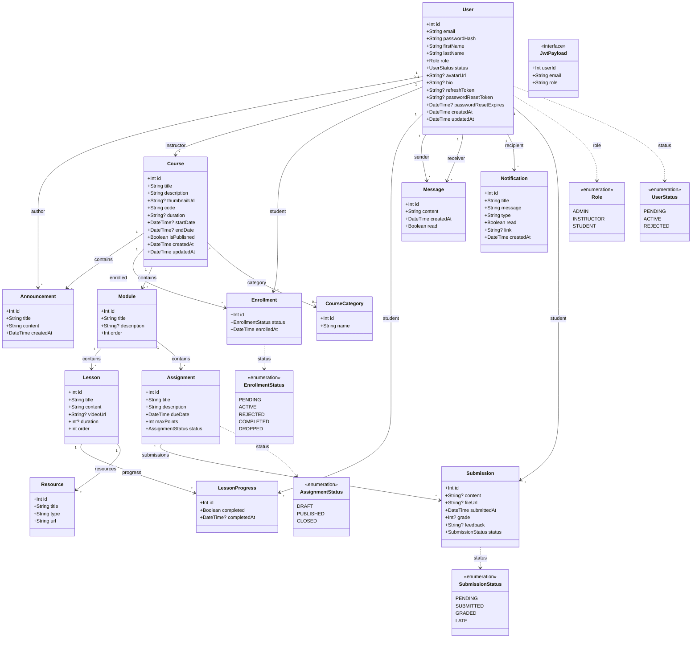

# Class Diagram — Lumify LMS

```mermaid
classDiagram
direction TB

%% Enums
class Role {
  <<enumeration>>
  ADMIN
  INSTRUCTOR
  STUDENT
}
class UserStatus {
  <<enumeration>>
  PENDING
  ACTIVE
  REJECTED
}
class EnrollmentStatus {
  <<enumeration>>
  PENDING
  ACTIVE
  REJECTED
  COMPLETED
  DROPPED
}
class AssignmentStatus {
  <<enumeration>>
  DRAFT
  PUBLISHED
  CLOSED
}
class SubmissionStatus {
  <<enumeration>>
  PENDING
  SUBMITTED
  GRADED
  LATE
}

%% Models
class User {
  +Int id
  +String email
  +String passwordHash
  +String firstName
  +String lastName
  +Role role
  +UserStatus status
  +String? avatarUrl
  +String? bio
  +String? refreshToken
  +String? passwordResetToken
  +DateTime? passwordResetExpires
  +DateTime createdAt
  +DateTime updatedAt
}

class Course {
  +Int id
  +String title
  +String description
  +String? thumbnailUrl
  +String code
  +String? duration
  +DateTime? startDate
  +DateTime? endDate
  +Boolean isPublished
  +DateTime createdAt
  +DateTime updatedAt
}

class Module {
  +Int id
  +String title
  +String? description
  +Int order
}

class Lesson {
  +Int id
  +String title
  +String content
  +String? videoUrl
  +Int? duration
  +Int order
}

class LessonProgress {
  +Int id
  +Boolean completed
  +DateTime? completedAt
}

class Assignment {
  +Int id
  +String title
  +String description
  +DateTime dueDate
  +Int maxPoints
  +AssignmentStatus status
}

class Submission {
  +Int id
  +String? content
  +String? fileUrl
  +DateTime submittedAt
  +Int? grade
  +String? feedback
  +SubmissionStatus status
}

class Enrollment {
  +Int id
  +EnrollmentStatus status
  +DateTime enrolledAt
}

class Message {
  +Int id
  +String content
  +DateTime createdAt
  +Boolean read
}

class Notification {
  +Int id
  +String title
  +String message
  +String type
  +Boolean read
  +String? link
  +DateTime createdAt
}

class Announcement {
  +Int id
  +String title
  +String content
  +DateTime createdAt
}

class Resource {
  +Int id
  +String title
  +String type
  +String url
}

class CourseCategory {
  +Int id
  +String name
}

%% Server Utilities
class JwtPayload {
  <<interface>>
  +Int userId
  +String email
  +String role
}

%% Relationships
User "1" --> "*" Announcement : author
User "0..1" --> "*" Course : instructor
User "1" --> "*" Enrollment : student
User "1" --> "*" LessonProgress : student
User "1" --> "*" Message : sender
User "1" --> "*" Message : receiver
User "1" --> "*" Notification : recipient
User "1" --> "*" Submission : student

Course "1" --> "*" Announcement : contains
Course "1" --> "*" Enrollment : enrolled
Course "1" --> "*" Module : contains
Course "0..*" --> "0..1" CourseCategory : category

Module "1" --> "*" Lesson : contains
Module "1" --> "*" Assignment : contains

Lesson "1" --> "*" LessonProgress : progress
Lesson "1" --> "*" Resource : resources

Assignment "1" --> "*" Submission : submissions

User ..> Role : role
User ..> UserStatus : status
Enrollment ..> EnrollmentStatus : status
Assignment ..> AssignmentStatus : status
Submission ..> SubmissionStatus : status
```
