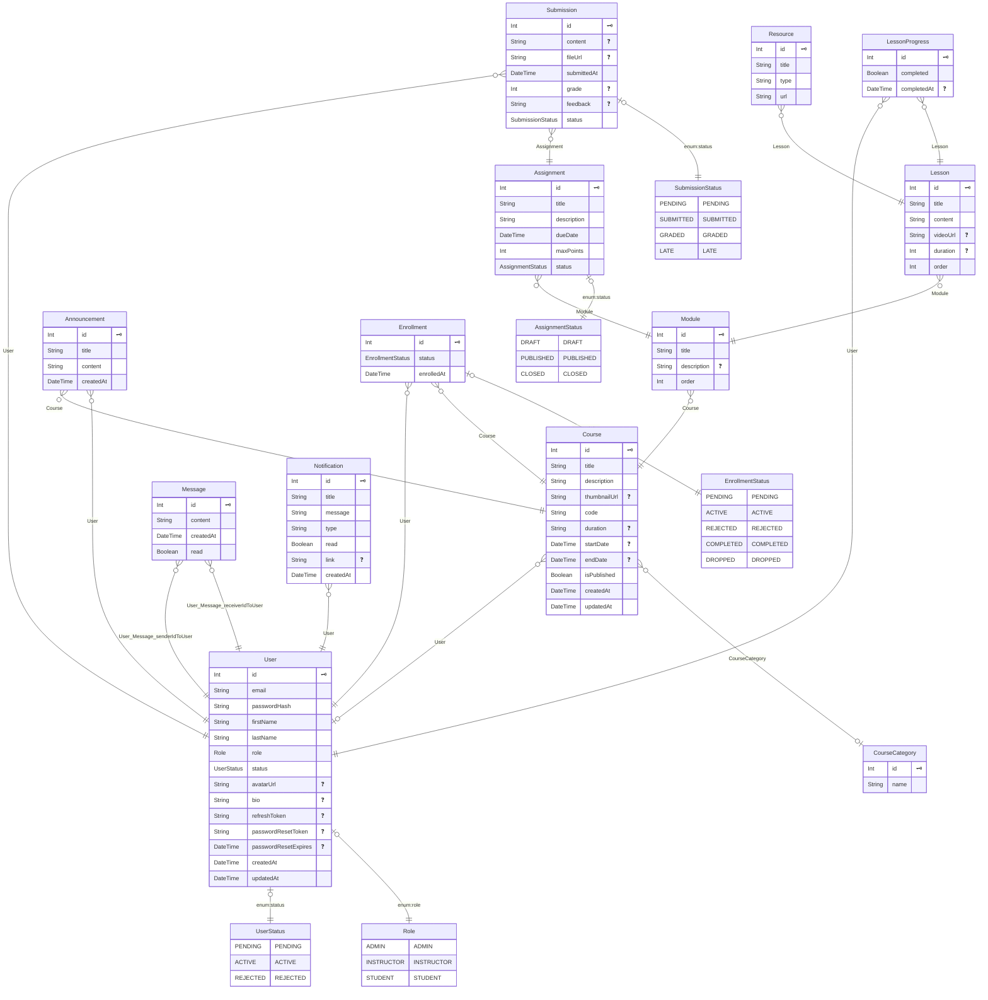

```mermaid
erDiagram

        AssignmentStatus {
            DRAFT DRAFT
PUBLISHED PUBLISHED
CLOSED CLOSED
        }
    


        EnrollmentStatus {
            PENDING PENDING
ACTIVE ACTIVE
REJECTED REJECTED
COMPLETED COMPLETED
DROPPED DROPPED
        }
    


        Role {
            ADMIN ADMIN
INSTRUCTOR INSTRUCTOR
STUDENT STUDENT
        }
    


        UserStatus {
            PENDING PENDING
ACTIVE ACTIVE
REJECTED REJECTED
        }
    


        SubmissionStatus {
            PENDING PENDING
SUBMITTED SUBMITTED
GRADED GRADED
LATE LATE
        }
    
  "Announcement" {
    Int id "🗝️"
    String title 
    String content 
    DateTime createdAt 
    }
  

  "Assignment" {
    Int id "🗝️"
    String title 
    String description 
    DateTime dueDate 
    Int maxPoints 
    AssignmentStatus status 
    }
  

  "Course" {
    Int id "🗝️"
    String title 
    String description 
    String thumbnailUrl "❓"
    String code 
    String duration "❓"
    DateTime startDate "❓"
    DateTime endDate "❓"
    Boolean isPublished 
    DateTime createdAt 
    DateTime updatedAt 
    }
  

  "CourseCategory" {
    Int id "🗝️"
    String name 
    }
  

  "Enrollment" {
    Int id "🗝️"
    EnrollmentStatus status 
    DateTime enrolledAt 
    }
  

  "Lesson" {
    Int id "🗝️"
    String title 
    String content 
    String videoUrl "❓"
    Int duration "❓"
    Int order 
    }
  

  "LessonProgress" {
    Int id "🗝️"
    Boolean completed 
    DateTime completedAt "❓"
    }
  

  "Message" {
    Int id "🗝️"
    String content 
    DateTime createdAt 
    Boolean read 
    }
  

  "Notification" {
    Int id "🗝️"
    String title 
    String message 
    String type 
    Boolean read 
    String link "❓"
    DateTime createdAt 
    }
  

  "Module" {
    Int id "🗝️"
    String title 
    String description "❓"
    Int order 
    }
  

  "Resource" {
    Int id "🗝️"
    String title 
    String type 
    String url 
    }
  

  "Submission" {
    Int id "🗝️"
    String content "❓"
    String fileUrl "❓"
    DateTime submittedAt 
    Int grade "❓"
    String feedback "❓"
    SubmissionStatus status 
    }
  

  "User" {
    Int id "🗝️"
    String email 
    String passwordHash 
    String firstName 
    String lastName 
    Role role 
    UserStatus status 
    String avatarUrl "❓"
    String bio "❓"
    String refreshToken "❓"
    String passwordResetToken "❓"
    DateTime passwordResetExpires "❓"
    DateTime createdAt 
    DateTime updatedAt 
    }
  
    "Announcement" }o--|| "User" : "User"
    "Announcement" }o--|| "Course" : "Course"
    "Assignment" |o--|| "AssignmentStatus" : "enum:status"
    "Assignment" }o--|| "Module" : "Module"
    "Course" }o--|o "CourseCategory" : "CourseCategory"
    "Course" }o--|o "User" : "User"
    "Enrollment" |o--|| "EnrollmentStatus" : "enum:status"
    "Enrollment" }o--|| "Course" : "Course"
    "Enrollment" }o--|| "User" : "User"
    "Lesson" }o--|| "Module" : "Module"
    "LessonProgress" }o--|| "Lesson" : "Lesson"
    "LessonProgress" }o--|| "User" : "User"
    "Message" }o--|| "User" : "User_Message_receiverIdToUser"
    "Message" }o--|| "User" : "User_Message_senderIdToUser"
    "Notification" }o--|| "User" : "User"
    "Module" }o--|| "Course" : "Course"
    "Resource" }o--|| "Lesson" : "Lesson"
    "Submission" |o--|| "SubmissionStatus" : "enum:status"
    "Submission" }o--|| "Assignment" : "Assignment"
    "Submission" }o--|| "User" : "User"
    "User" |o--|| "Role" : "enum:role"
    "User" |o--|| "UserStatus" : "enum:status"
```
