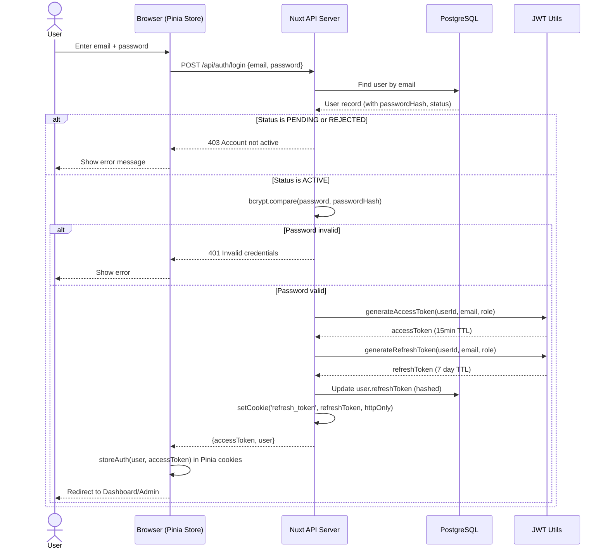
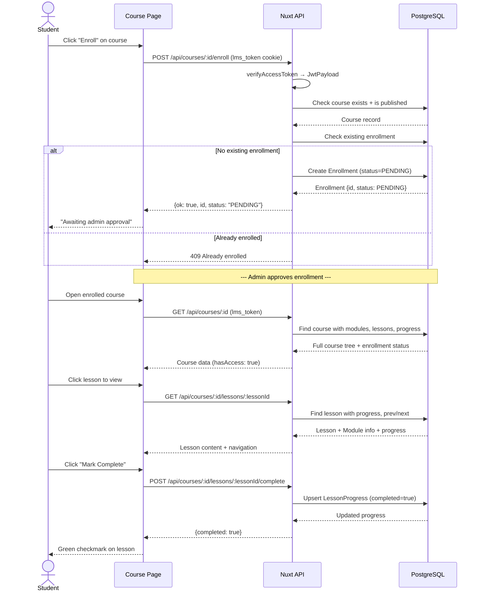
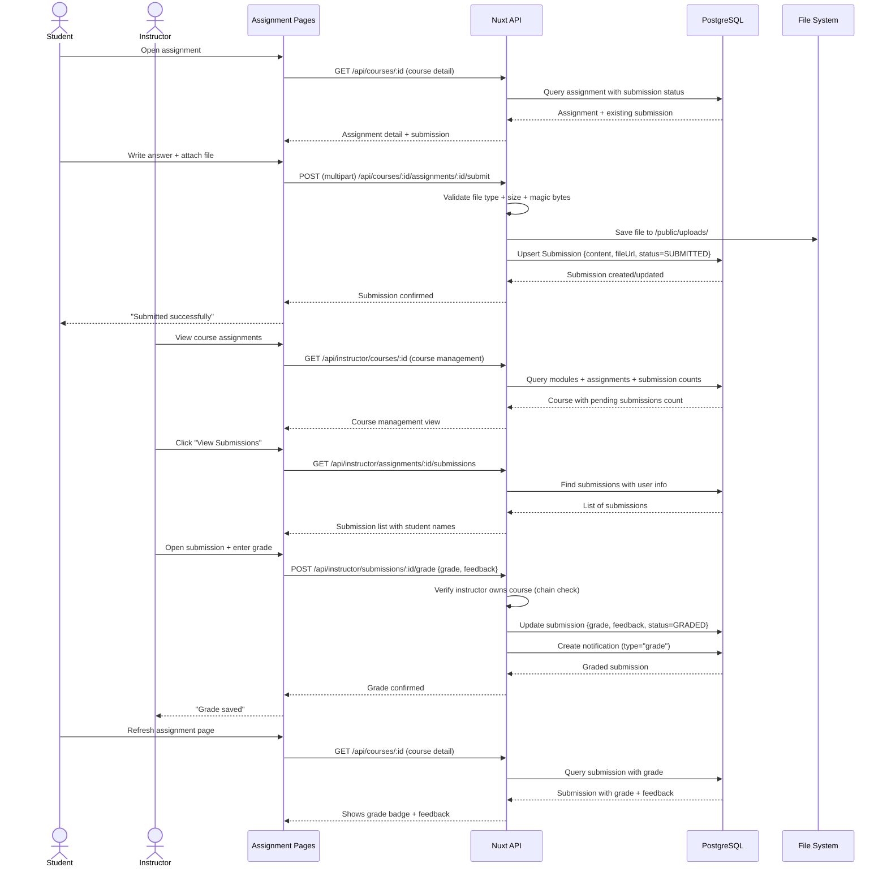

# Sequence Diagrams — Lumify LMS

## 1. Authentication Flow (Login + Token Refresh)

```mermaid
sequenceDiagram
    actor User
    participant Browser as Browser (Pinia Store)
    participant API as Nuxt API Server
    participant DB as PostgreSQL
    participant JWT as JWT Utils

    User->>Browser: Enter email + password
    Browser->>API: POST /api/auth/login {email, password}
    API->>DB: Find user by email
    DB-->>API: User record (with passwordHash, status)
    
    alt Status is PENDING or REJECTED
        API-->>Browser: 403 Account not active
        Browser-->>User: Show error message
    else Status is ACTIVE
        API->>API: bcrypt.compare(password, passwordHash)
        alt Password invalid
            API-->>Browser: 401 Invalid credentials
            Browser-->>User: Show error
        else Password valid
            API->>JWT: generateAccessToken(userId, email, role)
            JWT-->>API: accessToken (15min TTL)
            API->>JWT: generateRefreshToken(userId, email, role)
            JWT-->>API: refreshToken (7 day TTL)
            API->>DB: Update user.refreshToken (hashed)
            API->>API: setCookie('refresh_token', refreshToken, httpOnly)
            API-->>Browser: {accessToken, user}
            Browser->>Browser: storeAuth(user, accessToken) in Pinia cookies
            Browser-->>User: Redirect to Dashboard/Admin
        end
    end
```

## 2. Enrollment + Lesson Completion Flow

```mermaid
sequenceDiagram
    actor Student
    participant Page as Course Page
    participant API as Nuxt API
    participant DB as PostgreSQL

    Student->>Page: Click "Enroll" on course
    Page->>API: POST /api/courses/:id/enroll (lms_token cookie)
    API->>API: verifyAccessToken → JwtPayload
    API->>DB: Check course exists + is published
    DB-->>API: Course record
    API->>DB: Check existing enrollment
    alt No existing enrollment
        API->>DB: Create Enrollment (status=PENDING)
        DB-->>API: Enrollment {id, status: PENDING}
        API-->>Page: {ok: true, id, status: "PENDING"}
        Page-->>Student: "Awaiting admin approval"
    else Already enrolled
        API-->>Page: 409 Already enrolled
    end

    Note over Page,DB: --- Admin approves enrollment ---

    Student->>Page: Open enrolled course
    Page->>API: GET /api/courses/:id (lms_token)
    API->>DB: Find course with modules, lessons, progress
    DB-->>API: Full course tree + enrollment status
    API-->>Page: Course data (hasAccess: true)
    
    Student->>Page: Click lesson to view
    Page->>API: GET /api/courses/:id/lessons/:lessonId
    API->>DB: Find lesson with progress, prev/next
    DB-->>API: Lesson + Module info + progress
    API-->>Page: Lesson content + navigation
    
    Student->>Page: Click "Mark Complete"
    Page->>API: POST /api/courses/:id/lessons/:lessonId/complete
    API->>DB: Upsert LessonProgress (completed=true)
    DB-->>API: Updated progress
    API-->>Page: {completed: true}
    Page-->>Student: Green checkmark on lesson
```

## 3. Assignment Submission + Grading Flow

```mermaid
sequenceDiagram
    actor Student
    actor Instructor
    participant Page as Assignment Pages
    participant API as Nuxt API
    participant DB as PostgreSQL
    participant FS as File System

    Student->>Page: Open assignment
    Page->>API: GET /api/courses/:id (course detail)
    API->>DB: Query assignment with submission status
    DB-->>API: Assignment + existing submission
    API-->>Page: Assignment detail + submission

    Student->>Page: Write answer + attach file
    Page->>API: POST (multipart) /api/courses/:id/assignments/:id/submit
    API->>API: Validate file type + size + magic bytes
    API->>FS: Save file to /public/uploads/
    API->>DB: Upsert Submission {content, fileUrl, status=SUBMITTED}
    DB-->>API: Submission created/updated
    API-->>Page: Submission confirmed
    Page-->>Student: "Submitted successfully"

    Instructor->>Page: View course assignments
    Page->>API: GET /api/instructor/courses/:id (course management)
    API->>DB: Query modules + assignments + submission counts
    DB-->>API: Course with pending submissions count
    API-->>Page: Course management view

    Instructor->>Page: Click "View Submissions"
    Page->>API: GET /api/instructor/assignments/:id/submissions
    API->>DB: Find submissions with user info
    DB-->>API: List of submissions
    API-->>Page: Submission list with student names

    Instructor->>Page: Open submission + enter grade
    Page->>API: POST /api/instructor/submissions/:id/grade {grade, feedback}
    API->>API: Verify instructor owns course (chain check)
    API->>DB: Update submission {grade, feedback, status=GRADED}
    API->>DB: Create notification (type="grade")
    DB-->>API: Graded submission
    API-->>Page: Grade confirmed
    Page-->>Instructor: "Grade saved"

    Student->>Page: Refresh assignment page
    Page->>API: GET /api/courses/:id (course detail)
    API->>DB: Query submission with grade
    DB-->>API: Submission with grade + feedback
    API-->>Page: Shows grade badge + feedback
```
